<div align="center">

# 🎬 AuroraFlix

**A full-featured streaming platform for movies & series - built with Next.js on the frontend and a fleet of Go microservices on the backend.**

[](https://auroraflix.cloud)

[](https://nextjs.org)
[](https://react.dev)
[](https://www.typescriptlang.org)
[](https://go.dev)
[](https://clerk.com)
[](https://stripe.com)
[](https://ai.google.dev)
[](https://tailwindcss.com)
[](https://workers.cloudflare.com)

<br/>

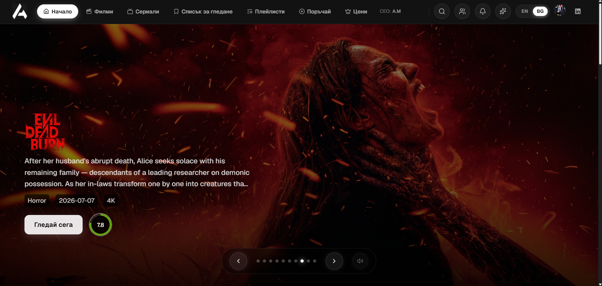

</div>

<br/>

AuroraFlix is a complete streaming experience - a browsable catalog of movies and series, per-title pages with trailers, cast and image galleries, an in-house multi-mirror video player with burned-in subtitle overlays, watchlists and playlists, a friends system with live presence, an AI recommendation assistant, and paid subscriptions via Stripe. It's bilingual (🇧🇬 Bulgarian / 🇬🇧 English) and runs on a real backend - a set of Go microservices - rather than mocked data.

## ✨ Features

### 🏠 Discovery & Catalog
- 🎠 Home page with an auto-rotating hero carousel, a "continue watching" row, and trending/popular rails for movies and series
- 🔍 Full catalog with genre / year / sort filters and actor search, plus a live search dropdown with instant suggestions
- 🎭 Actor pages - bio, birthplace, popularity, and a "check for more titles" action pulling their latest work

<div align="center">
<table><tr>
<td width="50%">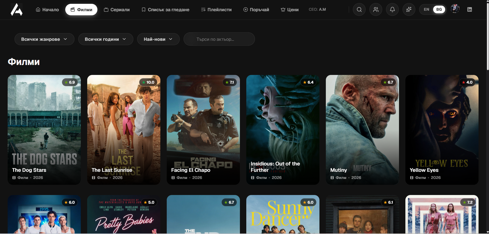</td>
<td width="50%">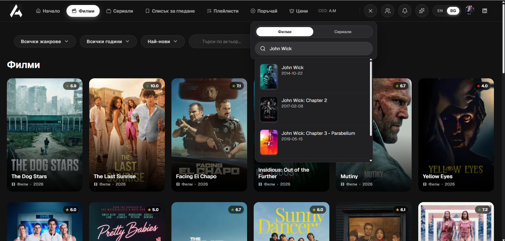</td>
</tr></table>
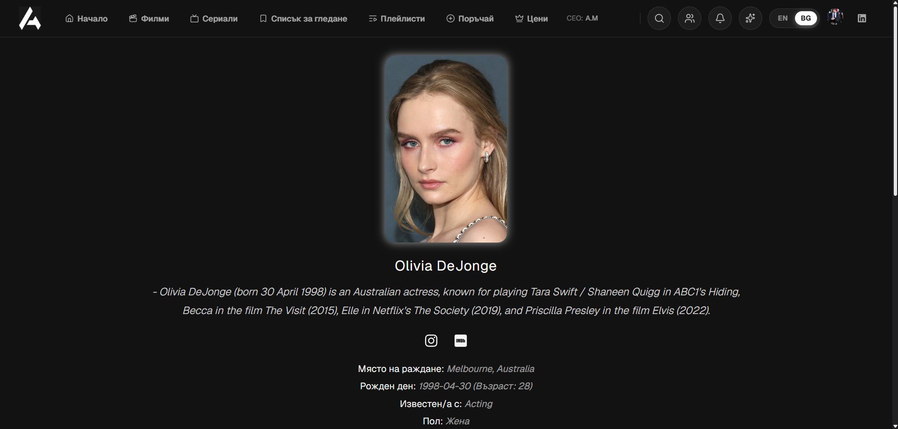
</div>

### 🎬 Title pages & playback
- 📄 Rich detail pages - synopsis, genres, TMDB rating ring, YouTube trailer embed, cast grid, and a still/poster image gallery
- ▶️ Custom video player with **3 selectable mirrors**, so playback survives a single source going down
- 💬 Burned-in subtitle overlay, synced independently of the embedded player via a hand-rolled VTT parser
- 📺 Full episode browser for series, with a "check for new episodes" action

<div align="center">
<table><tr>
<td width="50%">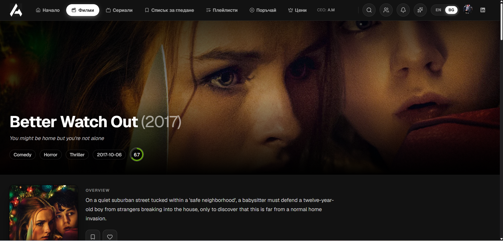</td>
<td width="50%">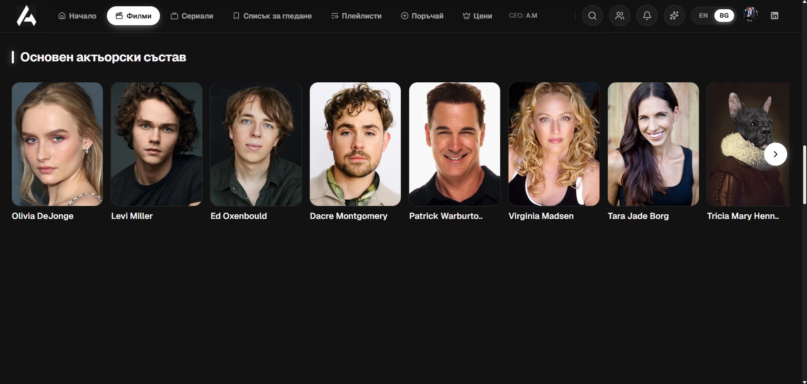</td>
</tr></table>
<table><tr>
<td width="50%">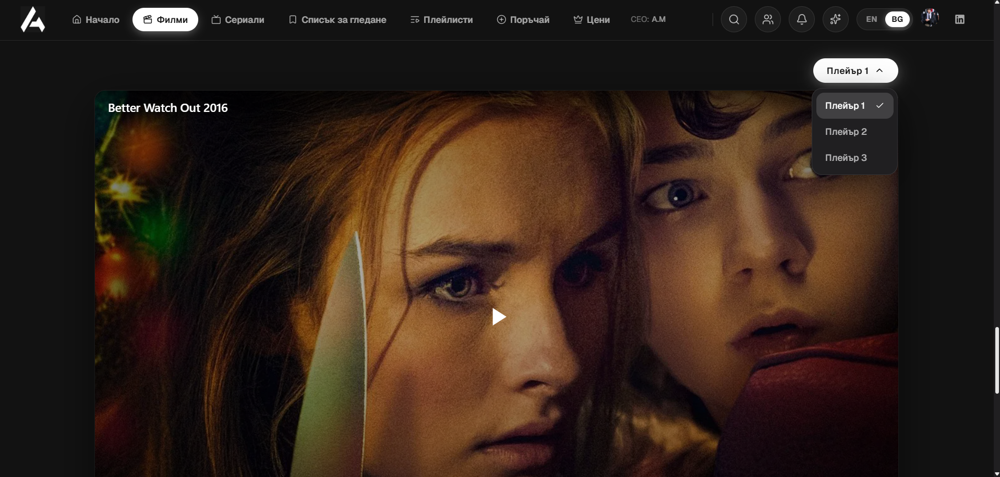</td>
<td width="50%">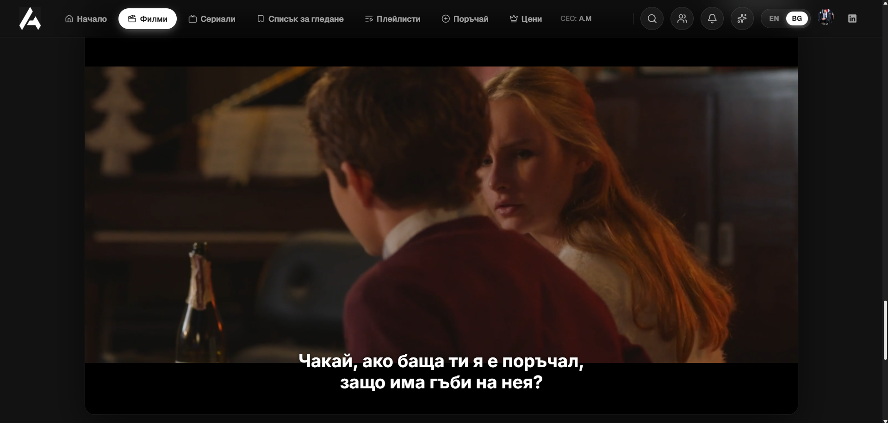</td>
</tr></table>
</div>

### ❤️ Personal library
- 📌 Watchlist (up to 20 titles) and a like/favorites system
- 🗂️ Custom playlists - public or private, shareable with friends
- 💬 Comments on every title, with likes/dislikes and edit/delete on your own comments
- 🗳️ "Order a title" - request anything missing from the catalog and it gets added within seconds

<div align="center">
<table><tr>
<td width="50%">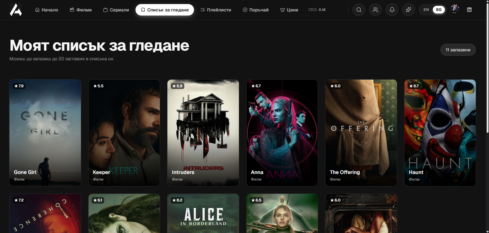</td>
<td width="50%">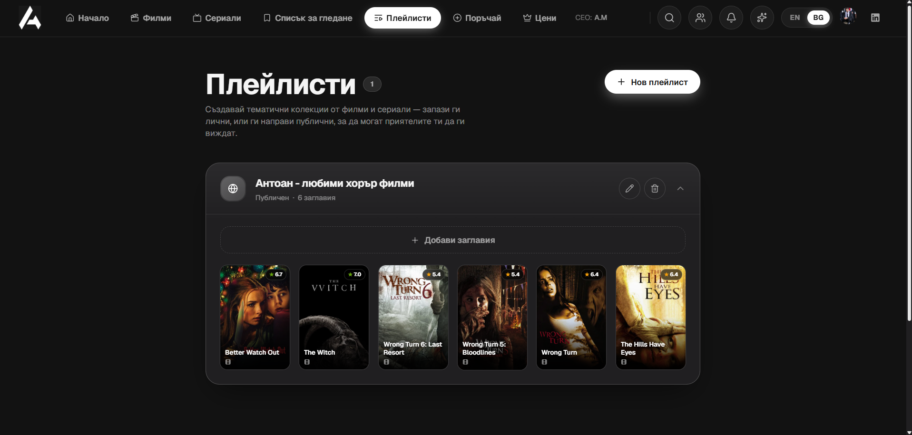</td>
</tr></table>
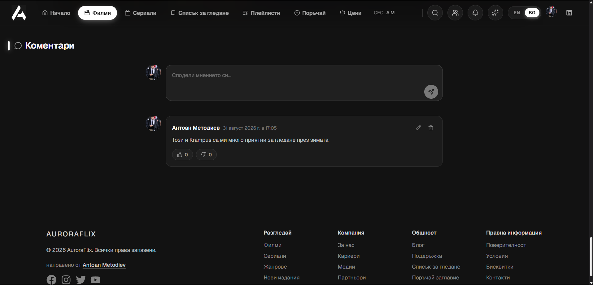
</div>

### 👥 Social & live presence
- 🤝 Friends system - search, send/accept requests, and browse a friend's shared playlists and liked titles
- 🔴 Real-time "friend is watching X" presence pushed over a **direct WebSocket** connection to the API gateway
- 🔔 Live notifications for friend requests and acceptances, delivered the same way

<div align="center">
<table><tr>
<td width="50%">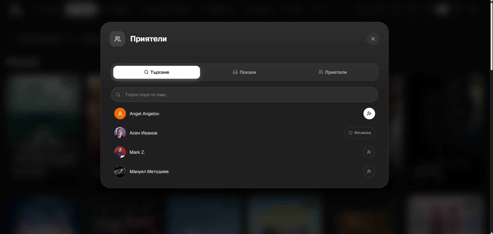</td>
<td width="50%">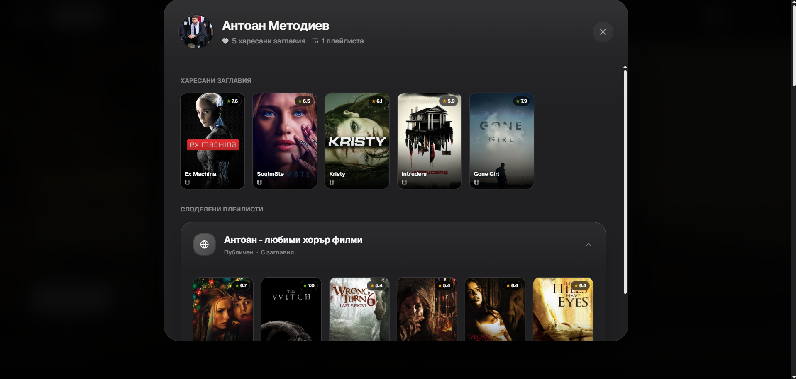</td>
</tr></table>
</div>

### 🤖 AI Assistant
- 💬 A Gemini-powered chat assistant, scoped strictly to movies/series recommendations
- 🎯 Personalizes suggestions using your own likes/watchlist, then renders each recommended title as a rich inline card (poster, rating, genres, synopsis) resolved back against the real catalog

<div align="center">
<table><tr>
<td width="50%">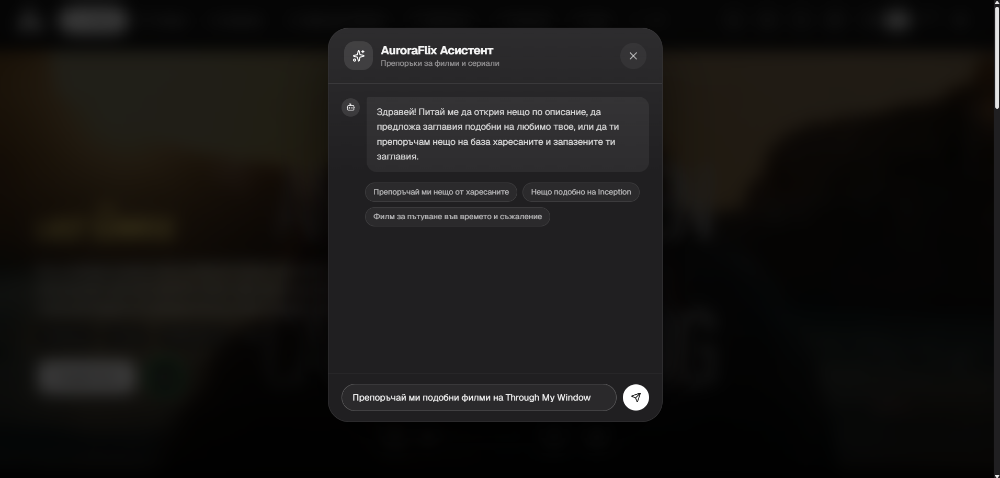</td>
<td width="50%">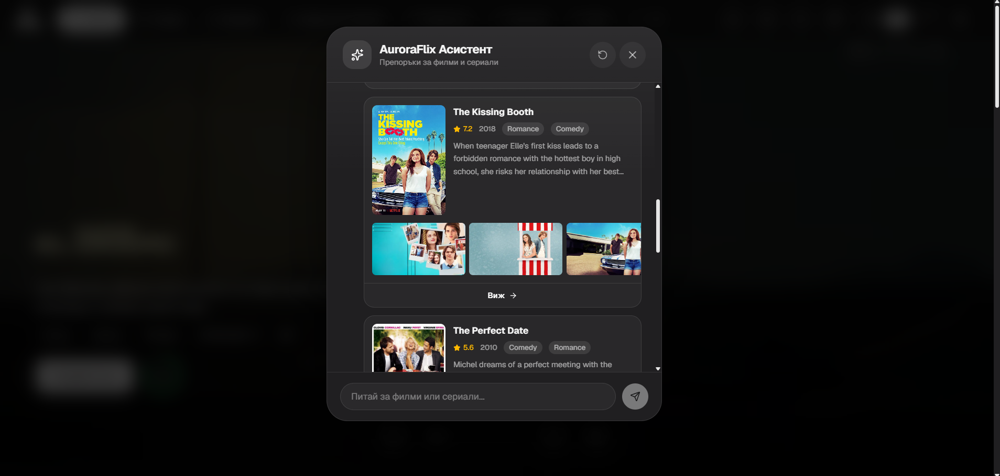</td>
</tr></table>
</div>

### 💳 Accounts & Subscriptions
- 🔐 Clerk authentication - email/password and Google sign-in, avatar upload, profile management
- 👑 Free / Pro pricing tiers (4K + HDR, ad-free, multi-device, unlimited watchlist) with **Stripe Checkout** for upgrades and a customer portal for managing the subscription

<div align="center">
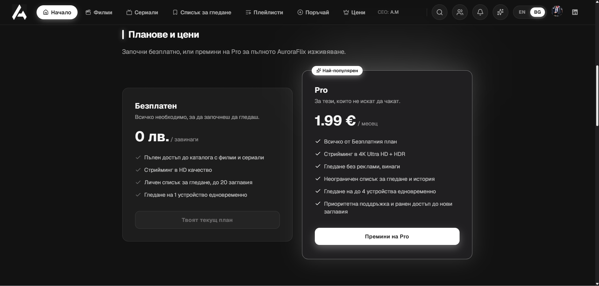
<table><tr>
<td width="50%">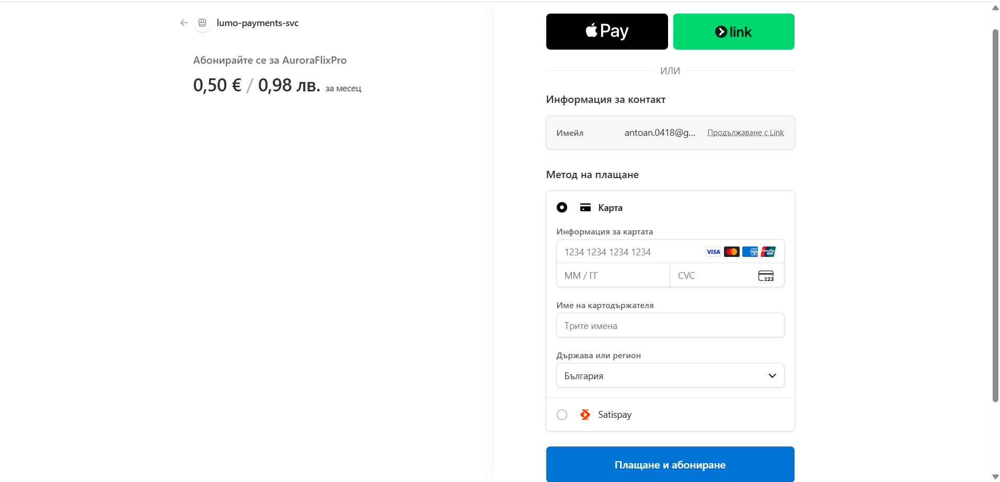</td>
<td width="50%">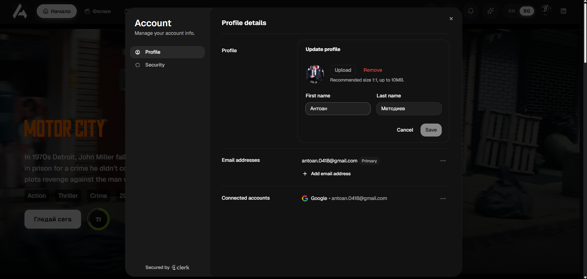</td>
</tr></table>
</div>

## 🧰 Tech Stack

| Layer | Technology |
|---|---|
| 🖼️ Framework | [Next.js 16](https://nextjs.org) (App Router) |
| 📘 Language | TypeScript, React 19 |
| 🎨 Styling | Tailwind CSS v4 |
| 🔐 Auth | [Clerk](https://clerk.com) - session verification done by hand per-route (`@clerk/backend`), since Cloudflare Workers can't run Next 16's Node-only `proxy.ts` |
| 🗄️ Backend | A fleet of **Go microservices** (`lumo-api-gateway`, `lumo-user-svc`, `lumo-payments-svc`, `lumo-movies-subtitles-taker-svc`), hosted on Render |
| 🎞️ Catalog data | [TMDB](https://www.themoviedb.org) |
| ▶️ Playback | Embedded multi-mirror players + a hand-rolled VTT subtitle overlay |
| 🖼️ Media/CDN | TMDB images, [Cloudinary](https://cloudinary.com), Clerk avatar CDN - `next/image` unoptimized (already pre-sized at the source) |
| 🔌 Realtime | Direct browser↔gateway WebSocket for friend requests & "friend is watching" presence |
| 🤖 AI | [Google Gemini](https://ai.google.dev) (`gemini-3.5-flash-lite`) via a lightweight REST wrapper |
| 💳 Payments | [Stripe](https://stripe.com) Checkout + customer portal |
| 🌍 i18n | Hand-rolled bg/en locale system (cookie + `Accept-Language` detection, resolved server-side) |
| ☁️ Deployment | Cloudflare Workers, via [`@opennextjs/cloudflare`](https://opennext.js.org/cloudflare) + Wrangler |

## 📁 Project Structure

```
app/
  api/               Same-origin proxy routes to the Go gateway (auth, payments, comments, friends, ...)
  movies/, series/    Catalog, search, genre & detail pages
  actors/            Actor detail pages
  account/, order/, playlists/, watchlist/, friends/   Feature pages
lib/                 Data fetching, hooks, i18n, Clerk auth helpers, config
components/          UI components, grouped by feature area (movies/details, friends, payments, ...)
types/               Shared TypeScript types (movie, series, actor, comment, episode, ...)
```

## 🚀 Getting Started

### Prerequisites
- Node.js 20+
- A [Clerk](https://clerk.com) application
- Access to the AuroraFlix backend gateway (or your own compatible API for local development)

### Setup

```bash
npm install
```

Create a `.env.local`:

```bash
NEXT_PUBLIC_CLERK_PUBLISHABLE_KEY=
CLERK_SECRET_KEY=
NEXT_PUBLIC_CLERK_SIGN_IN_URL=/sign-in
NEXT_PUBLIC_CLERK_SIGN_UP_URL=/sign-up
NEXT_PUBLIC_SITE_URL=http://localhost:3000
```

Start the dev server:

```bash
npm run dev
```

Open [http://localhost:3000](http://localhost:3000) 🎉

## ☁️ Deployment

AuroraFlix deploys to **Cloudflare Workers** via the OpenNext Cloudflare adapter:

```bash
npm run cf:preview   # build + local Workers preview
npm run cf:deploy     # build + deploy
```

## 📝 Notes

- 🎬 Catalog data comes from TMDB; new titles can also be pulled in on demand from the "Order a title" page.
- 🧪 Backend, payments and auth all talk to real services - nothing on the product surface is mocked.

</div>
